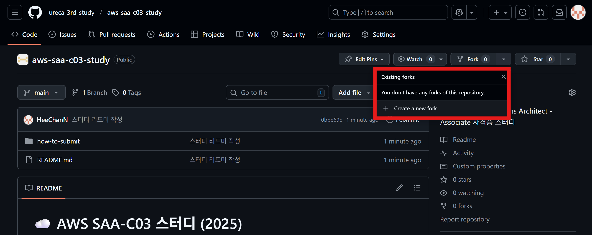
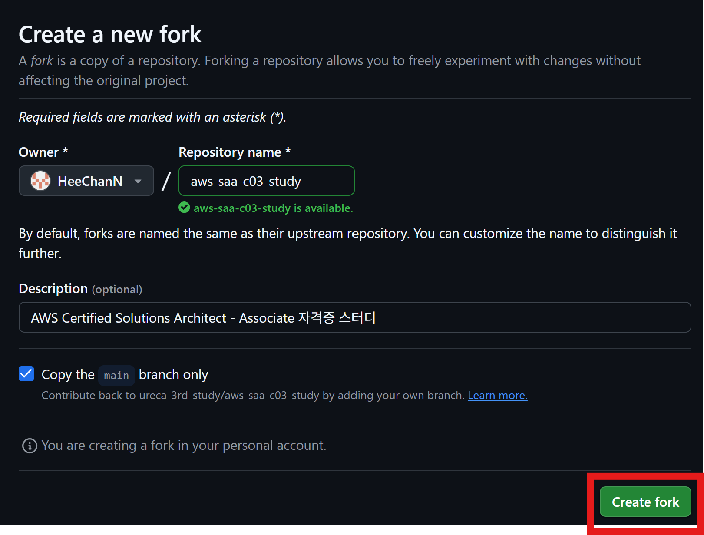
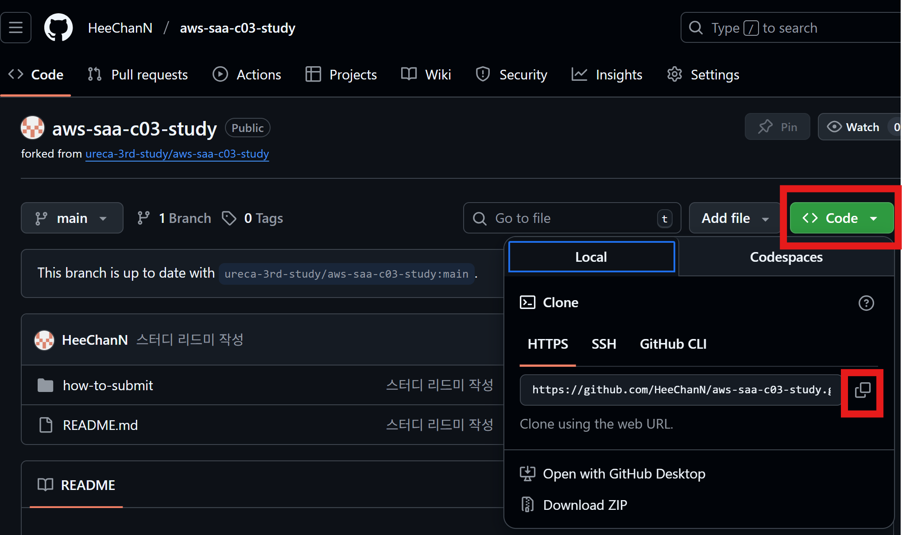
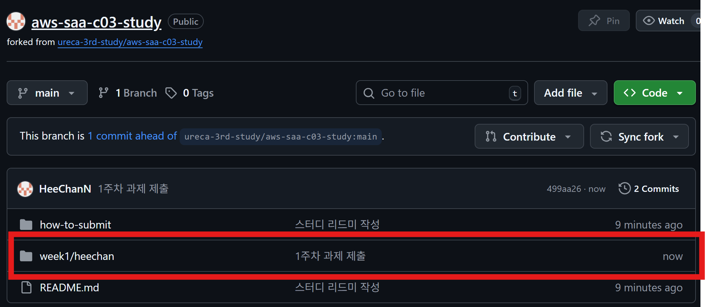
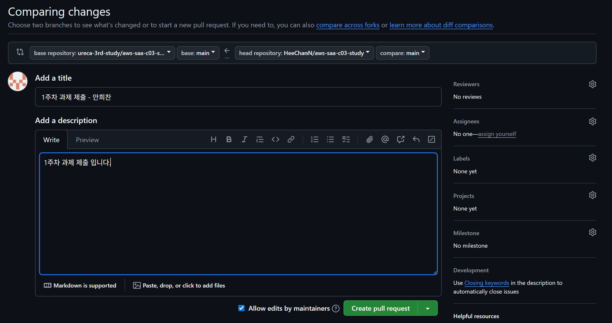
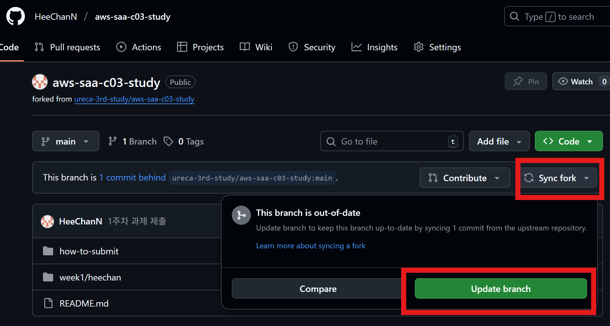

## 과제 제출 방법

### 1. Fork 하기

[레포지토리](https://github.com/ureca-3rd-study/aws-saa-c03-study)에 접속해 Fork 버튼을 누르고 Create a new fork를 클릭한다.



그럼, 아래 화면이 나오는데 바로 Create fork 버튼을 클릭한다.




<br>

### 2. Clone 및 폴더 생성

Fork가 진행되면 내 레포지토리에 다음 사진과 같이 생성된다. 여기서 Code 버튼을 누르고 URL을 복사하자.



VS code를 이용해 터미널에 다음 명령어를 작성한다.

- git이 없으면 구글에 검색해서 설치하기
- VS code 없으면 설치하기


```bash
git clone <복사한 주소>
```

<br>

`week<주차>/` 폴더에 자신의 영문이름(ex. heechan)으로 폴더를 만들고 그 안에 마크다운 파일로 문제 풀이 작성하기

- week1의 heechan 폴더 참고하기
- 문제는 `exam/` 폴더에서 복붙해오고 자신이 생각하는 답 아래 적기

<br>

### 3. 자신의 깃허브에 push 하기

문제를 다풀었다면 다음 명령어를 통해 먼저 자신의 깃허브에 올린다.

```bash
git add .
git commit -m "n 주차 문제풀이 - 안희찬"
git push origin main
```



<br>

### 4. PR 생성하기

push 까지 했다면 조직의 레포지토리에 PR 생성하기 Contribute 버튼 클릭하면 아래와 같은 화면이 뜬다. 제목에 자신의 이름 붙여주고 설명에는 자유롭게 작성해서 Create pull request 버튼 클릭하기



<br>

### 5. Sync 맞춰주기

다음주차에는 Fork한 레포지토리를 그대로 사용해도 됩니다. 대신 아래와 같이 Sync 버튼을 클릭해서 조직 레포지토리의 내용과 Fork한 레포지토리의 바뀐 내역을 일치시켜주고 작업을 시작하세요!

> 만약 조직에 있는 레포지토리에 변경사항이 없다면 Update 버튼이 없을겁니다.



---
